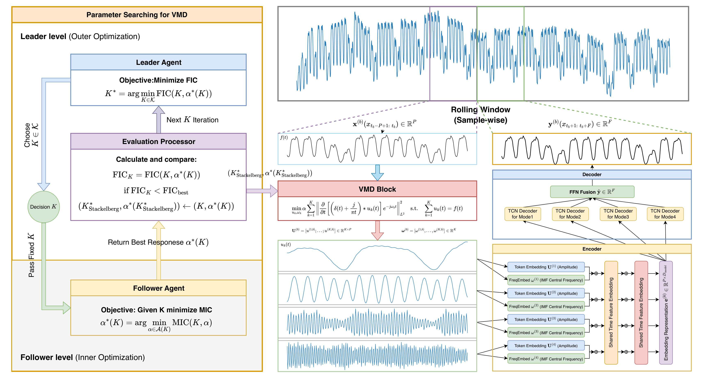

# VMDNet: Temporal Leakage-Free Variational Mode Decomposition for Electricity Demand Forecasting

[](https://www.python.org/)
[](https://pytorch.org/)
[](LICENSE)


## 🏗 Model Architecture



## 🚀 Implementation


### 1. Installation

- Python ≥ 3.8  
- Recommended: create a fresh virtual environment (`conda` or `venv`)

```bash
cd VMDNet
pip install -r requirements.txt
```

Make sure your PyTorch installation matches your CUDA version if you plan to use GPU.

---

### 2. Data

The default configuration of VMDNet supports three public electricity demand datasets:

1. **Poland power system demand (ENTSO-E)**  
   https://www.entsoe.eu/data/power-stats/

2. **ISO New England (ISO-NE)**  
   https://www.iso-ne.com/isoexpress/web/reports/load-and-demand/-/tree/dmnd-rt-hourly-sys

3. **Australian Energy Market Operator (AEMO) – New South Wales (NSW)**  
   https://www.aemo.com.au/energy-systems/electricity/

All datasets consist of hourly average electricity demand records spanning  
**January 1, 2021 to June 13, 2024**, resulting in **30,216 samples per dataset**.

> ⚠️ The raw datasets are not redistributed in this repository.  
> Please download the data directly from the official sources above.

After downloading, place the processed data file under:

- Root directory: `./dataset/`
- File: `datasets.xlsx`

You may:

- Add your own time series into `datasets.xlsx` and select them via `--data` / `--target`, or  
- Implement a custom dataset loader under `data_provider/` following the existing structure.

---


### 3. Long-term Forecasting Template

You can train and evaluate VMDNet via the command line or a bash script by the template:

```bash
python run.py \
  # ===== Task & Data =====
  --task_name long_term_forecast \
  --is_training 1 \
  --model_id <experiment_name> \
  --model VMDNet \
  --data <dataset_name> \
  --root_path <data_root> \
  --data_path <data_file> \
  --features <S/M/MS> \
  --target <target_variable> \
  --freq <h/d/...> \
  --seq_len <input_length> \
  --pred_len <prediction_length> \

  # ===== VMD Module =====
  --vmd_K <num_modes> \
  --vmd_alpha <bandwidth_constraint> \
  --vmd_tau <noise_tolerance> \
  --vmd_tol <convergence_tol> \

  # ===== TCN Decoder =====
  --tcn_hidden_dims "<dim1 dim2 ...>" \
  --tcn_dropout <dropout_rate> \

  # ===== Fusion Module =====
  --fusion_method <fusion_type> \
  --ffn_hidden_dim <hidden_dim> \

  # ===== Training =====
  --batch_size <batch_size> \
  --learning_rate <lr> \
  --train_epochs <epochs> \
  --loss_function <loss_type> \
  --use_gpu true\

# Optional:
#   --use_amp
#   --use_multi_gpu
```
---
### 4. Main Components

- `models/VMDNet.py`
  - `VMDModule`: applies VMD to decompose the input series into multiple modes and their center frequencies.
  - `MultiModeDataEmbedding`: builds value + positional + temporal + frequency embeddings for each mode.
  - `MultiModeTCNDecoder`: one TCN decoder per mode (multi-branch structure).
  - `FusionModule`: fuses the outputs of all branches into the final prediction.
- `exp/exp_long_term_forecasting.py`
  - Training / validation / testing loops and metric computation for long-term forecasting.
- `run.py`
  - Unified CLI entry for selecting the task, dataset, and model hyperparameters.

## 🙏 Acknowledgment

Parts of the training pipeline are adapted from the 
[Time-Series-Library](https://github.com/thuml/Time-Series-Library) (MIT License).

The implementation of Variational Mode Decomposition (VMD) is adapted from 
[vmdpy](https://github.com/vrcarva/vmdpy) (MIT License).

We thank the original authors for making their code publicly available.